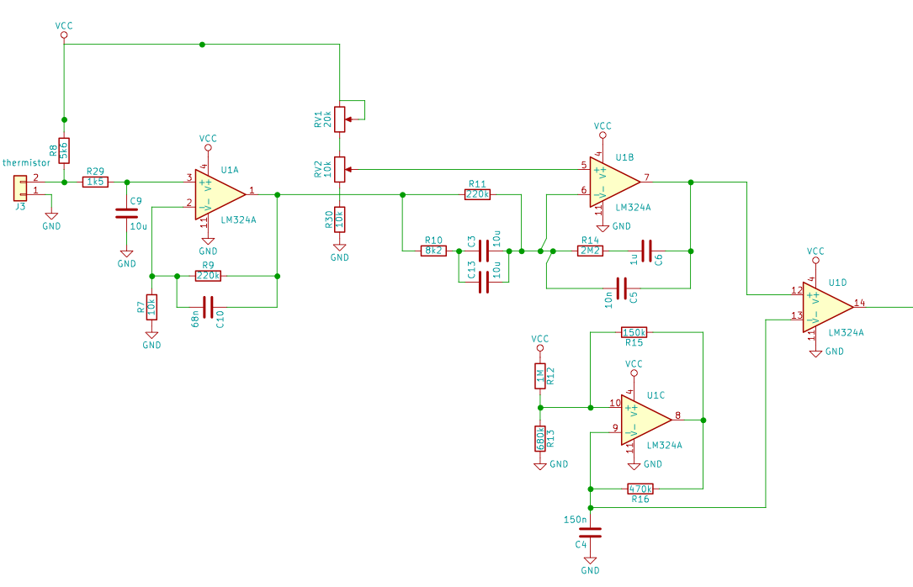
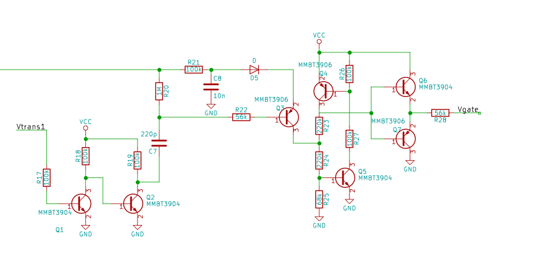
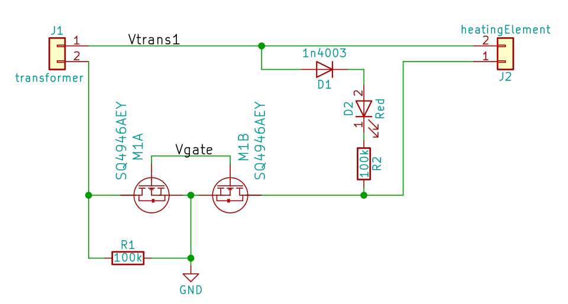
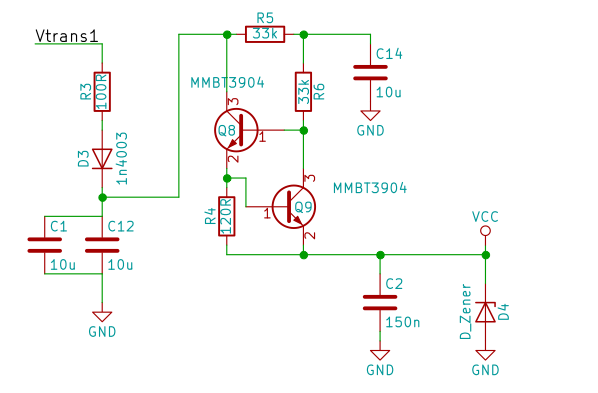
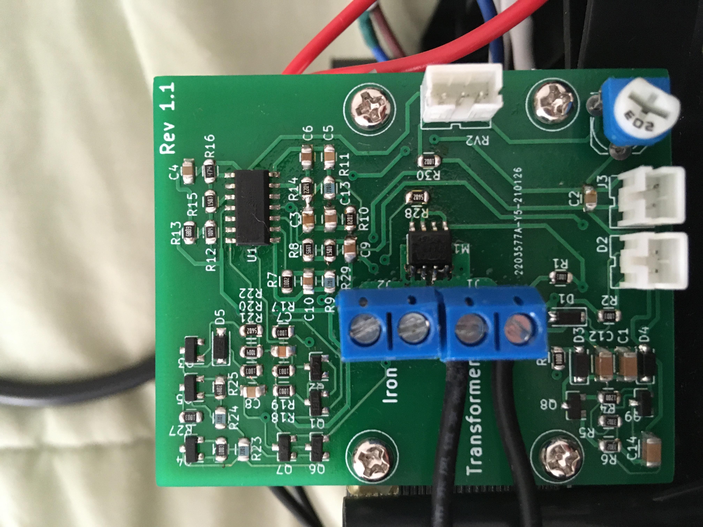
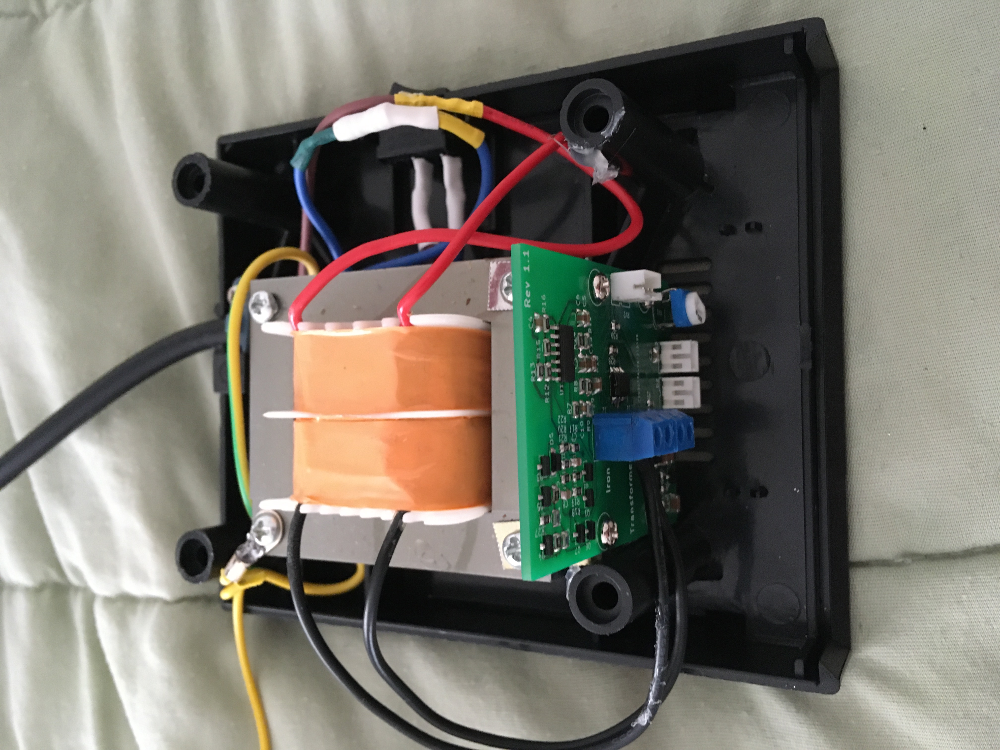
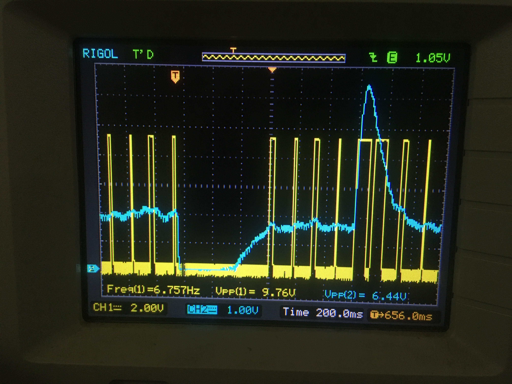

# Temperature Controller for Hakko 936 Clone

## Overview
 * PID type controller for regulating the temperature of a soldering iron
 * Control done with lm324 quad opamp
 * Heating element switched with back to back mosfets
 * Switching is done only on voltage zero crossings

## Implementation

### PID Controller
 * Fixed Frequency PWM done at about 6 Hz
 * Signal Path
  1. Active Low-Pass Filter / amplifier
  1. Opamp with compenstion network
  1. PWM circuitry
  1. Zero cross detection
  1. MOSFET gate

above: low-pass, PWM circuitry.    below: zero cross below

#### Active Low-Pass Filter
 * Purpose
   1. Remove a troublesome 60Hz ripple
   1. Increase the small voltage from the thermistor
 * low voltage was a result of low resistance of thermistor and trying to avoid self-heating or using much power
 * gain is 23 v/v for DC
 * 2 poles at about 11 Hz
 
#### Opamp with compenstaion network
  * Gives +50 degrees of phase shift near crossover
  * Has gain magnitude of about 50 v/v at crossover
  * The previous two things come at the cost of significant gain at 60 Hz which caused problems

#### PWM
  * Nothing interesting here
  * An opamp compares output of previous stage to "triangle like" waveform produced by relaxation oscillator

#### Zero Cross Detection
  * Only triggers on rising edge
  * When transformer voltage crosses zero, a short pulse is sent to a latch
  * The pulse allows the latch to change state if such a thing is "requested" by the PWM circuitry
  * The latch drives the gates of the MOSFET's
  * This configuration is not ideal. It works fine for switching MOSFETs on, but do to the inductance of the transformer the zero crossing of the voltage is not at the zero crossing of the current. So there is still some energy stored in the inductor when the swiches open. This didn't cause any real problems, but it would be nice to get this right.

### Switching
 * The Sources of the MOSFETs were connected together
 * This node was also the cicuit ground
   * This made it very easy to switch mosfets
 * The advantages of using MOSFETs
   * Easy to control
   * Low voltage drop results in high efficiency and no need for heat sinking
 * Used a SQ4946AEY Dual MOSFET
 * The gates are intentionally driven through a large resitor to slow switching times

### Power Supply for Control Circuitry
 * Shunt Zener Regulator
   * used a current source in place of usual resitor due to issues caused by 60 Hz ripple on supply rail
 * avoided electrolytic capacitors bc the the case can get quite warm

### PCB
* Had to fit in existing case
* Double sided
* Ordered from prototyping service (JLC PCB)
* I had to hand-solder everything

* Connected to existing case with M3 screws and bits of metal cut from a can
  * This may seem crude, but the board stays in place. Also the can is too flexible to put much stress on the board, so chip capacitors are unlikely to crack.

## Results
 * It has little to no practical improvement over the original hysteresis style controller
 * That said I've used this new controller for a while and I like it
 * It seems to provide excellent regulation of the heating element temperature, but in practice this is rather useless. I believe this is due to poor coupling between heating element and  the actual tip.

In the above picture the reference voltage was changed a little and the controller was able to adjust the temperature of the heating element with minimal overshoot in just a few hundred milliseconds. Channel 1 is the Gate Source voltage of the MOSFETs and Channel 2 is the input to the PWM "comparator".
